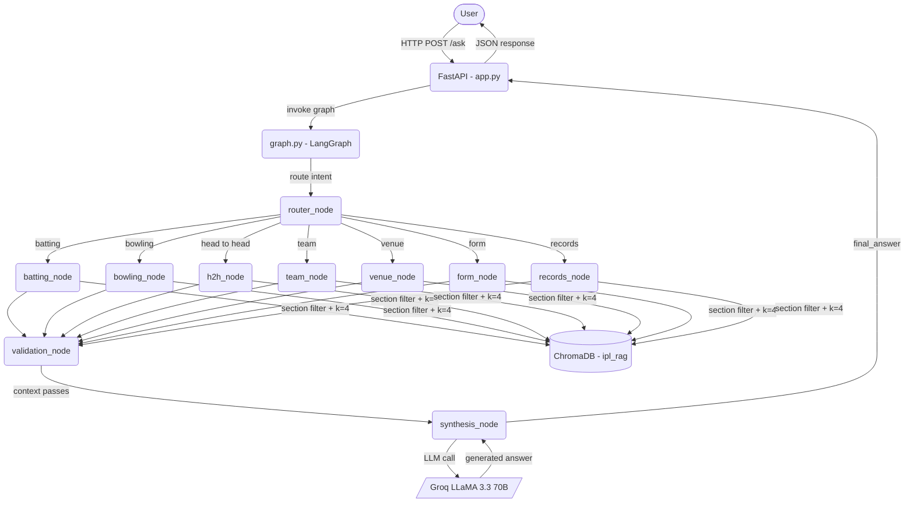
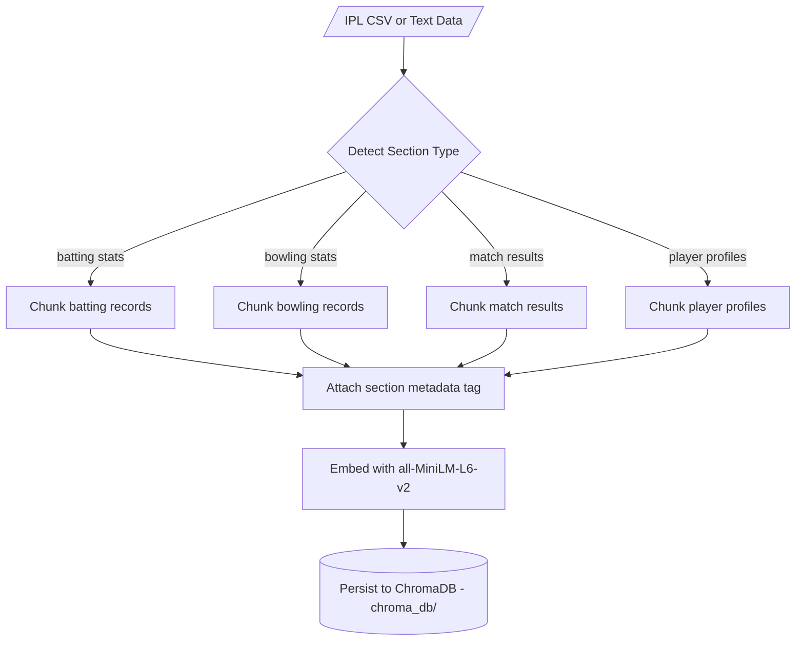
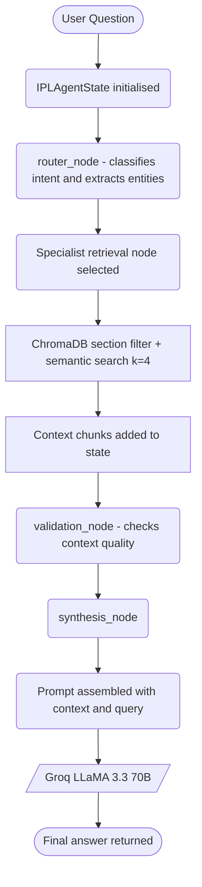
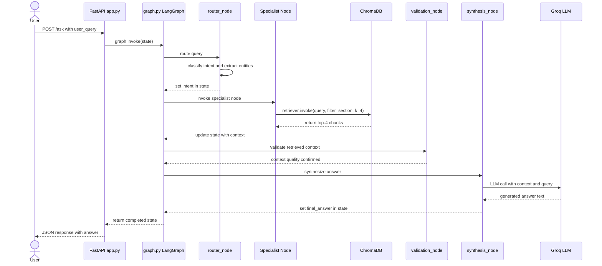
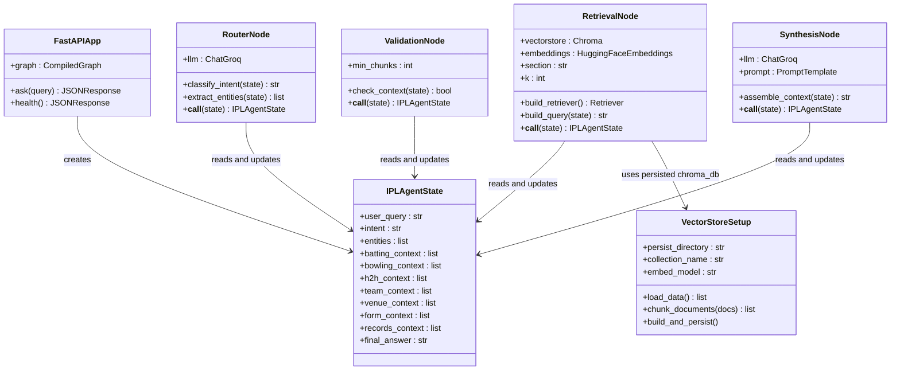

# 🏏 IPL Cricket Q&A — LangGraph RAG System

IPL Cricket Q&A is an AI-powered cricket statistics chatbot built using Python and FastAPI. You ask natural language questions about IPL matches, players, and teams, and the system retrieves accurate answers from a ChromaDB vector knowledge base. It does not make up statistics or rely on general knowledge — every answer is grounded in the indexed IPL data.

---

## What This Project Does

The system routes your question to the most relevant specialist retrieval node using a LangGraph state machine, fetches matching chunks from ChromaDB, and synthesizes a final answer using a Groq-hosted LLM.

The following query types are supported:

**Batting** — runs, strike rates, centuries, and batting averages for any player or season.

**Bowling** — wickets, economy rates, best figures, and bowling averages.

**Head-to-Head** — win/loss records between any two IPL teams.

**Team Performance** — overall season records, win rates, and playoff history.

**Venue** — ground-specific stats, average scores, and pitch behavior.

**Player Form** — recent match-by-match performance for any player.

**Records** — all-time IPL records such as most runs, most wickets, and highest team totals.

---

## UML Diagrams

### 1. System Architecture

Shows all layers — User, API layer, LangGraph graph, specialist nodes, and ChromaDB.



---

### 2. Vector Store Ingestion Pipeline

Shows how IPL data is loaded, chunked, embedded, and saved to ChromaDB with section metadata.



---

### 3. RAG Query Flow

Shows how a user question flows through routing, section-filtered retrieval, validation, and synthesis to produce an answer.



---

### 4. Sequence Diagram

Shows the full order of interactions between all components from query to answer.



---

### 5. Class Diagram

Shows all classes, their attributes, methods, and relationships.



---

## How It Works

When you send a query, the FastAPI server passes it into the LangGraph graph as an `IPLAgentState` object. The router node reads the query, classifies the intent (batting, bowling, h2h, etc.), and extracts named entities like player or team names.

The graph then routes to the matching specialist node. Each node connects to ChromaDB and filters by its own `section` metadata tag, so a batting question only searches batting chunks and a venue question only searches venue chunks. The node runs a semantic search with `k=4` and writes the retrieved documents back into the state.

After retrieval, the validation node checks that enough context was returned. The synthesis node then assembles all retrieved chunks, builds a prompt, and calls the Groq API to generate a final grounded answer.

---

## Technologies Used

- Python 3.11
- FastAPI for the API server
- LangGraph for the agentic graph orchestration
- LangChain for retriever and LLM wrappers
- Groq API with the LLaMA 3.3 70B model as the language model
- ChromaDB for storing and searching document embeddings
- HuggingFace Sentence Transformers (`all-MiniLM-L6-v2`) for generating embeddings

---

## Project Structure

The `app.py` file is the FastAPI application. It defines the `/ask` endpoint and invokes the LangGraph graph per request.

The `main.py` file is the entry point that starts the Uvicorn server.

The `graph.py` file defines the LangGraph state machine — all nodes, edges, and conditional routing logic.

The `state.py` file defines the `IPLAgentState` TypedDict that is passed between every node.

The `nodes/` folder contains all specialist nodes. `router.py` classifies intent and extracts entities. `batting.py`, `bowling.py`, `h2h.py`, `team.py`, `venue.py`, `form.py`, and `records.py` each handle retrieval for their respective domain. `validation.py` checks retrieved context quality. `synthesis.py` assembles context and calls the LLM.

The `vectorstore/` folder contains `setup.py` which loads IPL data, chunks it, attaches section metadata, and persists it to ChromaDB.

The `chroma_db/` folder is where the persisted ChromaDB vector store is saved. This is auto-generated when you run the setup script.

The `requirements.txt` file lists all Python dependencies.

---

## How to Run the Project

Clone the repository and go into the project folder.

```bash
git clone https://github.com/konduri-lakshmi-prasanna/ipl_rag.git
cd ipl_rag
```

Create a virtual environment and activate it.

```bash
python -m venv .venv
source .venv/bin/activate
```

Install the Python packages.

```bash
pip install -r requirements.txt
```

Create a `.env` file in the project folder and add your Groq API key like this.

```
GROQ_API_KEY=your_key_here
```

Build the ChromaDB vector store from the IPL data.

```bash
python vectorstore/setup.py
```

Finally, run the API server.

```bash
python main.py
```

Then open your browser or API client and send requests to `http://localhost:8000`.

---

## How to Use the API

Send a POST request to `/ask` with your question as JSON.

```bash
curl -X POST http://localhost:8000/ask \
  -H "Content-Type: application/json" \
  -d '{"query": "What is the head-to-head record between CSK and MI?"}'
```

Example questions you can ask:

- "How many centuries has Virat Kohli scored in IPL?"
- "What is the head-to-head record between CSK and MI?"
- "Which venues have the highest average first innings score?"
- "Who has the most wickets at the Wankhede Stadium?"
- "What is RCB's win rate in playoff matches?"
- "Who has the best economy rate among all IPL bowlers?"

---

## Environment Variables

| Variable | Description |
|---|---|
| `GROQ_API_KEY` | Your Groq API key for LLM inference |

---

## What I Learned

This project helped me understand how agentic RAG systems work in practice. I learned how to design a multi-node LangGraph state machine, how to use ChromaDB section metadata for domain-filtered retrieval, how to pass state cleanly between nodes, how to integrate FastAPI with a compiled LangGraph graph, and how routing logic differs from a simple single-chain RAG pipeline.

---

## Author

Built by Prasanna Konduri as part of an AI/ML project at SVECW, exploring LangGraph agentic architectures, ChromaDB vector retrieval, and Groq-powered LLM inference for domain-specific Q&A.